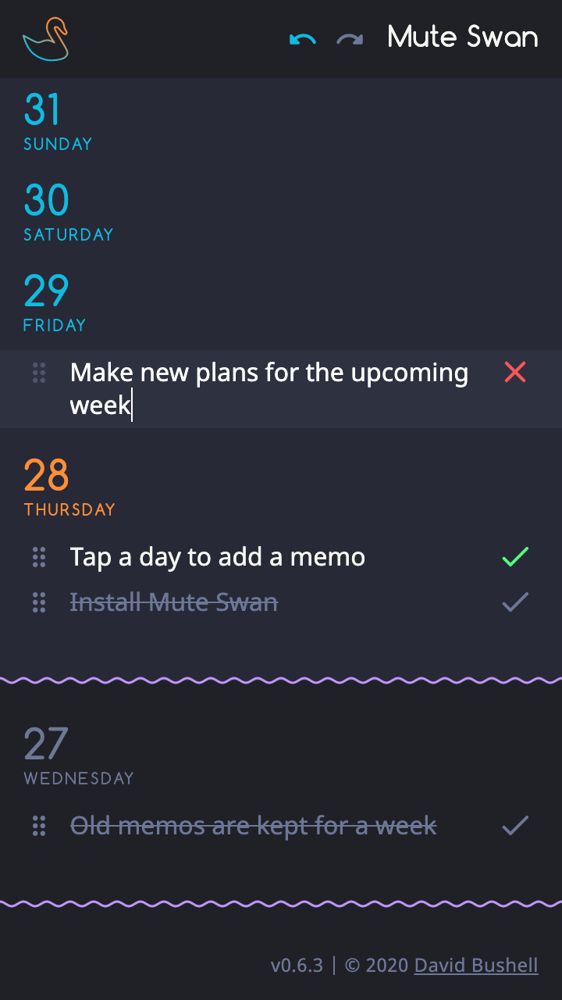

# Mute Swan  🦢

**✨ This project is no longer under active development. ✨**

* * *

**Mute Swan** is a short-term daily planner for todos and memos. Add items for the upcoming week. See a history of the past seven days. The app is centred around “today” and older items are automatically deleted.

]

* * *

## Additional notes

From my blog:

* [Bundle a PWA as an Android App](https://dbushell.com/2020/03/05/bundle-a-pwa-as-an-android-app/)
* [Bubblewrap Apps in Android Studio](https://dbushell.com/2020/06/01/bubblewrap-twa-pwa-apps-android-studio/)
* [PWA Encryption and Auto Sign-in](https://dbushell.com/2020/06/08/pwa-web-crypto-encryption-auto-sign-in-redux-persist/)

* * *

[MIT License](/LICENSE) | Copyright © 2020 [David Bushell](https://dbushell.com)
